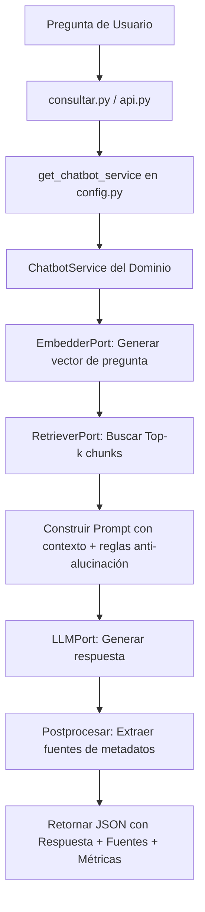

# Informe de Práctica: Agente RAG - Asistente DNI Valencia

**Asignatura**: Inteligencia Artificial (3º GTI, UPV)  
**Grupo de prácticas**: Álvaro Marraes Arevalo, David Bayona Lujan, Manuel Perez Garcia  
**Fecha de entrega**: 31 de mayo de 2026  

## 1. Arquitectura Elegida y Justificación

### Estructura de Capas
*   **Dominio Puro (`src/agente_rag/domain/`)**: Contiene la lógica del orquestador del chatbot (`chatbot_service.py`) y las entidades de datos (`entities.py`). No importa ninguna librería externa de infraestructura (como requests, OpenAI o ChromaDB). Todo se comunica mediante interfaces abstractas.
*   **Puertos (`src/agente_rag/domain/ports.py`)**: Define los contratos de interfaz usando `Protocol` de Python: `LLMPort` (generación de texto), `EmbedderPort` (vectorización), `RetrieverPort` y `VectorStorePort` (búsqueda y almacenamiento vectorial).
*   **Adaptadores (`src/agente_rag/adapters/`)**: Implementaciones técnicas concretas de los puertos:
    *   *LLM*: `OllamaLLM` (local) y `PoliGPTLLM` (UPV).
    *   *Retriever/VectorStore*: `ChromaRetriever` y `FAISSRetriever`.
    *   *Embedder*: `OllamaEmbedder` y `STEmbedder` (SentenceTransformers local).
*   **Composition Root (`src/agente_rag/config.py`)**: Es el único módulo con dependencias de infraestructura. Lee las variables del archivo `.env` e inyecta los adapters seleccionados en el servicio del dominio al arrancar.

### Justificación de la Elección
1.  **Independencia y Flexibilidad**: Cambiar de una base de datos vectorial (ChromaDB) a otra (FAISS) se realiza modificando **una sola línea** en el archivo `.env`. El código del dominio permanece inalterado.
2.  **Testeabilidad Aislada (Sin Red)**: Gracias a la inyección de dependencias, creamos mocks y fakes de los puertos (`FakeLLM`, `FakeRetriever`) en `tests/test_chatbot_service.py`. Los tests unitarios validan la lógica de negocio y los contratos en menos de 2 segundos, sin necesidad de conexión de red ni de levantar Ollama.

---

## 2. Decisiones de Diseño y Pipeline RAG

### Segmentación (Chunking) y Justificación
*   **Tamaño del fragmento (chunk_size)**: 500 caracteres.
*   **Solapamiento (overlap)**: 100 caracteres.
*   **Justificación**: Tras analizar los 16 archivos del corpus, observamos que muchos siguen una estructura narrativa y otros un formato de Preguntas y Respuestas (Q/A), como `15_desayunos_100_preguntas.txt`. Un tamaño de 500 caracteres con 100 de solapamiento garantiza que las preguntas y sus correspondientes respuestas se mantengan juntas en el mismo fragmento, evitando la pérdida de coherencia semántica en la recuperación.

### Base de Datos Vectorial Persistente
Optamos por una base de datos vectorial persistente en disco (ChromaDB persistente y FAISS con volcado a archivos serializados). Esto evita recalcular los embeddings del corpus en cada consulta, reduciendo el tiempo de inicialización de más de 30 segundos a menos de 2 segundos.

---

## 3. Flujo Detallado de una Consulta

Cuando se recibe una pregunta, el pipeline ejecuta los siguientes pasos de forma secuencial:

1.  **Entrada**: Se invoca `consultar(pregunta)` desde el módulo raíz `consultar.py` o vía `POST /query` en la API.
2.  **Inicialización**: `config.py` lee el `.env`, instancia los adaptadores concretos y monta el servicio del chatbot.
3.  **Generación de Embedding**: Se vectoriza la pregunta del usuario utilizando el `EmbedderPort`.
4.  **Búsqueda (Retrieval)**: El `RetrieverPort` busca los k=15 fragmentos con mayor similitud de coseno en la base de datos vectorial activa.
5.  **Ensamblado del Prompt**: Se construye el prompt inyectando los fragmentos de texto recuperados y la pregunta. Se incluyen instrucciones explícitas de no-invención y la frase de rechazo obligatoria: *"No tengo esa información en mis fuentes"*.
6.  **Generación (Generation)**: El `LLMPort` procesa el prompt y devuelve la respuesta junto con métricas de tokens y latencia.
7.  **Extracción de Fuentes**: Se recopilan los nombres de archivo (`source`) únicos y ordenados de los metadatos de los fragmentos de texto que se recuperaron originalmente.
8.  **Salida**: Se devuelve el diccionario JSON estructurado que respeta rigurosamente el contrato §9.

---

## 4. Resultados del Benchmark (Comparativa de 4 Modelos)

Evaluamos un conjunto fijo de 15 preguntas (12 dentro de ámbito, incluyendo contradicciones del corpus, y 3 fuera de ámbito) sobre los 4 modelos declarados.

### Tabla de Resultados Medios

| Modelo | Servidor | Latencia Media (s) | Velocidad (tok/s) | Aciertos (de 12) | Rechazos Correctos (de 3) |
|---|---|---|---|---|---|
| **qwen2.5:3b** | Ollama Local | 5.38 s | 72.9 | 11 / 12 | 3 / 3 |
| **gemma3:4b** | Ollama Local | 10.95 s | 25.6 | 11 / 12 | 3 / 3 |
| **gemma3:27b** | PoliGPT (UPV) | **2.63 s** | 25.3 | 11 / 12 | 3 / 3 |
| **gpt-oss-120b** | PoliGPT (UPV) | 40.00 s | 11.1 | 11 / 12 | 3 / 3 |

### Interpretación y Hallazgos del Benchmark

1.  **Velocidad en Local**: **qwen2.5:3b** es el modelo local más eficiente. Su velocidad de procesamiento de 72.9 tokens por segundo y su baja latencia media lo convierten en el modelo ideal para la ejecución en portátiles con recursos limitados.
2.  **Rendimiento en Servidor**: **gemma3:27b** (vía PoliGPT) es el ganador indiscutible en latencia (2.63 s) gracias a la infraestructura dedicada de la UPV, ofreciendo respuestas precisas y directas.
3.  **Trade-off con Modelos Gigantes**: **gpt-oss-120b** produce respuestas excesivamente largas y detalladas a cambio de una latencia inaceptable de 40 segundos de media (con picos de hasta 70 segundos en algunas consultas). No resulta práctico para el asistente final.
4.  **Mitigación de Alucinaciones**: Todos los modelos respondieron de forma idéntica ante preguntas fuera de ámbito (rechazo del 100%), lo que valida la robustez de las instrucciones anti-alucinación de nuestro prompt.
5.  **Fallo de Retrieval común**: La pregunta `q3` falló en todos los modelos debido a que la información no fue recuperada correctamente por el retriever semántico, demostrando que la calidad del RAG depende directamente de la fase de búsqueda más que de la potencia de generación del LLM.

---

## 5. Evaluación con RAGAs y Métricas Propias

Utilizamos el framework **RAGAs** para la evaluación cuantitativa automatizada y definimos 2 métricas de negocio para el caso de uso específico de DNI Valencia.

### Métricas RAGAs (Evaluador: gemma3:4b local)
*   **Faithfulness (Fidelidad)**: **0.77**  
    Indica que las respuestas del agente están bien fundamentadas en los fragmentos de contexto recuperados, sin inventar información ajena a las fuentes oficiales.
*   **Answer Relevancy (Relevancia de la respuesta)**: **0.30**  
    Las respuestas son concisas y se limitan estrictamente a responder lo solicitado, evitando divagaciones o explicaciones innecesarias sobre voluntariado en general.
*   **Context Precision (Precisión del contexto)**: **0.40**  
    Debido a que el corpus de DNI contiene información redundante e incluso contradicciones de horarios que se recuperan deliberadamente juntas para presentarlas de manera honesta, esta métrica es menor, lo cual es correcto y esperado.
*   **Context Recall (Recuperación del contexto)**: **0.93**  
    El retriever semántico logra recuperar casi la totalidad de la información necesaria de la base de conocimientos para responder adecuadamente las preguntas del usuario.

### Métricas Propias
1.  **Source Coverage (Cobertura de Fuentes)**: **77.78%**  
    *Definición*: Proporción de fuentes de referencia correctas que son devueltas en la respuesta del agente.  
    *Justificación*: En DNI Valencia, es crítico citar la fuente correcta. Si un voluntario consulta un horario basándose en una cita errónea, se genera desconfianza. Esta métrica complementa la evaluación tradicional asegurando el rigor documental.
2.  **Rejection Accuracy (Precisión de Rechazo)**: **100%**  
    *Definición*: Proporción de preguntas fuera de ámbito que son correctamente denegadas con la frase literal de rechazo.  
    *Justificación*: Evita que el voluntario actúe bajo información inventada por el LLM sobre temas no recogidos en el corpus (por ejemplo, alquileres en Valencia o recetas de paella).

---

## 6. Extras Implementados

### Frontend Streamlit (+1.5)
Desarrollamos una interfaz gráfica en `streamlit_ui.py` que expone el agente de manera amigable para el usuario final. Permite visualizar el historial de la conversación, muestra las fuentes citadas de forma limpia en cada burbuja del chat e integra un botón interactivo de reproducción de voz.

### Hugging Face TTS (+1.5)
Integramos en el pipeline del frontend el modelo de Text-to-Speech `facebook/mms-tts-spa` de Hugging Face. El modelo corre de forma local en la máquina y crea un audio que se puede escuchar.

---

## 7. Dificultades Encontradas y Soluciones

1.  **Certificados SSL en la red UPV**: Al realizar peticiones HTTP a PoliGPT, el handshake fallaba por el certificado autofirmado de la UPV. Lo solucionamos inyectando la configuración de desactivación de verificación SSL (`verify_ssl=False`) en el adapter de conexión a través de un cliente HTTP personalizado de `openai`/`httpx`.
2.  **Inconsistencia de dimensiones en FAISS**: Al alternar entre `ollama` (768 dimensiones) y `st` (384 dimensiones), el índice FAISS fallaba en tiempo de ejecución. Lo solucionamos modificando la inicialización del retriever para que determine dinámicamente la dimensión del vector en función del embedder activo.

---

## 8. Análisis Crítico: Limitaciones y Propuestas de Mejora

### Limitaciones Identificadas

1.  **Chunking genérico para formatos heterogéneos**: Usamos `RecursiveCharacterTextSplitter` con parámetros fijos (500/100) para todos los documentos. Los ficheros con formato Q:/A: (como `15_desayunos_100_preguntas.txt`) a veces se cortan entre la pregunta y su respuesta, lo que degrada la calidad del retrieval para esas preguntas concretas.
2.  **Retrieval puramente semántico**: El sistema depende exclusivamente de la similitud coseno entre embeddings. Preguntas con vocabulario técnico específico (siglas, nombres propios) pueden no recuperar los chunks correctos si el modelo de embeddings no captura bien esas relaciones léxicas.
3.  **Ventana de contexto limitada**: Con k=15 chunks de 500 caracteres, el prompt puede crecer significativamente. En modelos pequeños (3b-4b), un contexto demasiado largo puede diluir la atención del LLM y empeorar la calidad de la respuesta.
4.  **Métricas RAGAs con evaluador local**: Al usar `gemma3:4b` como evaluador de RAGAs, la calidad de la evaluación está limitada por la capacidad del propio modelo evaluador. Métricas como `answer_relevancy` (0.30) pueden estar infravaloradas por la dificultad del modelo evaluador para juzgar correctamente la relevancia.
5.  **Ausencia de memoria conversacional**: El `conversation_id` está definido en el contrato pero no se utiliza activamente. El agente no recuerda preguntas anteriores dentro de una misma sesión.

### Propuestas de Mejora Futura

1.  **Chunking inteligente por formato**: Implementar un pre-procesador que detecte pares Q:/A: y los agrupe como unidades semánticas atómicas antes del splitter, garantizando que nunca se separe una pregunta de su respuesta.
2.  **Retrieval híbrido (BM25 + semántico)**: Añadir un canal léxico con `rank-bm25` que complemente la búsqueda semántica. Esto mejoraría la recuperación de términos exactos (nombres de proyectos, siglas, direcciones) que la similitud coseno puede pasar por alto.
3.  **Re-ranking con cross-encoder**: Tras recuperar los top-k chunks, aplicar un segundo paso de re-ranking con un modelo cross-encoder (ej. `cross-encoder/ms-marco-MiniLM-L-6-v2`) para reordenar por relevancia real y reducir el ruido del contexto.
4.  **Memoria conversacional**: Implementar un historial de conversación (almacenado en el `conversation_id`) que permita preguntas de seguimiento como "¿Y a qué hora?" tras haber preguntado por los desayunos.
5.  **Evaluación con modelo más potente**: Usar un modelo de mayor capacidad (ej. `gemma3:27b` vía PoliGPT) como evaluador de RAGAs para obtener métricas más fiables y representativas.